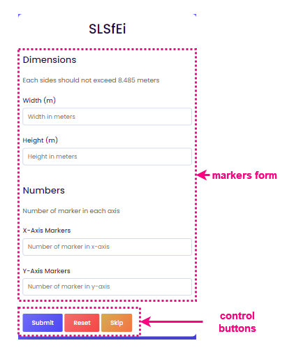
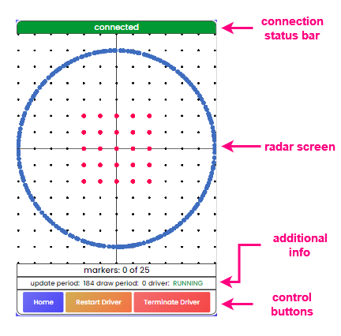

# Instruction

## Workflow
1. Operator specify desired marker settings in home page.
2. Operator move to a desired marker point by referencing positions displayed in radar page.
3. Operator touch or click afformentioned marker point to confirm that explosive has been installed at that point.
4. Operator repeat step 2 and 3 for all marker points
5. End.

## Home page
This page is for setting positions for marker points.

- Markers form
    
    &nbsp;&nbsp;&nbsp;&nbsp;On this page, there will be a form to fill in the setting for the marker points. This form will be divided into two parts.
    - Dimensions
        
        &nbsp;&nbsp;&nbsp;&nbsp;In this section, operator can define width and length of rectangle borders in meters.

        &nbsp;&nbsp;&nbsp;&nbsp;**Caution:** Due to the distance limitation of the rplidar model a1m8, each side length cannot exceed 8.485 meters.
    - Numbers
        
        &nbsp;&nbsp;&nbsp;&nbsp;In this section, the operator can define the number of marker points in each x-axis and y-axis. Marker points will be evenly spread out according to the boundaries defined in the dimensions section.

        &nbsp;&nbsp;&nbsp;&nbsp;**Example 1:** If the operator sets x-axis markers = 5 , y-axis = 5 , `5*5=25` markers will be generated, each of which will be spread out in a 5x5 grid.

        &nbsp;&nbsp;&nbsp;&nbsp;**Example 2:** If the operator sets x-axis markers = 5 , y-axis = 1 , `5*1=5` markers will be generated, each of which will be distributed along the x-axis.

        &nbsp;&nbsp;&nbsp;&nbsp;**Caution:** Each axis may not have a number of markers less than 1.
- Control buttons
    - Submit button
        
        &nbsp;&nbsp;&nbsp;&nbsp;Used to save settings to the browser's local storage and proceed to the radar page.
    - Reset button
        
        &nbsp;&nbsp;&nbsp;&nbsp;Used to clear settings from the browser's local storage.
    - Skip button

        &nbsp;&nbsp;&nbsp;&nbsp;Used to bypass settings on this page. and immediately proceed to the radar page.
        
        &nbsp;&nbsp;&nbsp;&nbsp;**Caution:** The radar page uses the last settings saved in your browser's local storage.

## Radar page
This page is for displaying marker points. scan data and status in real time

**Note:** Driver or scan provider refers to [rplidar connector](https://github.com/SLSfEi/scan-provider-cpp)

- Connection status bar
    
    &nbsp;&nbsp;&nbsp;&nbsp;Displays the connection status of the system. The possible statuses are as follows.
    
    Status | Color | Description
    --- | --- | ---
    connected | Green | Successfully connected to web-app and driver.
    connection timeout | Red | Successfully connected to web-app but unable to connect to driver.
    connection lost | Red | Unable to connect to web-app

- Radar screen
    
    &nbsp;&nbsp;&nbsp;&nbsp;Displays the position of the marker points and the position of the scanned data from the driver. Meaning of points on this screen Can be divided by color as follows.
    
    - Black
        
        &nbsp;&nbsp;&nbsp;&nbsp;Act as a reference point so that the operator can clearly see the proportions of the data.
        - Each point in this color is always 1 meter apart.
        - The intersecting line in the middle of the screen represents the point with coordinates (0,0), i.e. the location of the rplidar device.
        - The direction in which the coordinates are marked (+,+) is (right, top).
    
    - Red or green
        
        &nbsp;&nbsp;&nbsp;&nbsp;Represents the location of the marker points. according to the operator's settings on the main page

        - Red represents marker point where explosive has not been installed
        - Green represents marker point where explosive has been installed

        &nbsp;&nbsp;&nbsp;&nbsp;
        The operator can change the status of any marker point. By tapping or clicking on that point.
    
    - Blue
        
        &nbsp;&nbsp;&nbsp;&nbsp;Represent objects detected by the rplidar device. The object will usually be the operator themselves.
        
        &nbsp;&nbsp;&nbsp;&nbsp;**Suggestion:** Operators can try walking around in the area. to confirm their position on the radar screen.

- Additional info
    
    Name | Description
    --- | ---
    markers | Indicates the number of markers that have already been deployed.
    update_period | Indicates the period of time it takes to update the radar screen, in milliseconds (ms).
    draw_period | Indicates the period of time it takes to draw points on the radar screen in milliseconds (ms).
    driver | Indicates the status of the driver

    The status of the driver is as follows.
    
    Driver status | Description
    --- | ---
    RUNNING | Driver is running.
    STOPPED | Driver is stopped.
    UNKNOWN | Driver status is unknown.

- control buttons
    
    - Home button

        &nbsp;&nbsp;&nbsp;&nbsp;Used to go back to the main page
    - Restart Driver button
        
        &nbsp;&nbsp;&nbsp;&nbsp;Used to stop and restart the driver.
    - Terminate Driver button
        
        &nbsp;&nbsp;&nbsp;&nbsp;Used to stop the driver
    
    &nbsp;&nbsp;&nbsp;&nbsp;**Note:** If the web-app cannot locate the driver executable, the Restart Driver and Terminate Driver buttons are disabled.