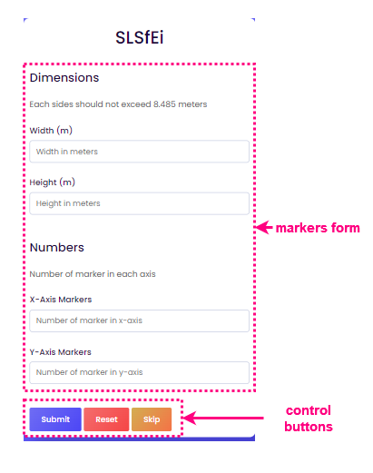
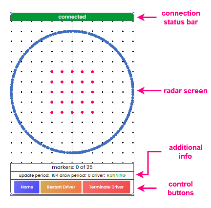

# คู่มือการใช้งาน

## ขั้นตอนการทำงาน
1. ผู้ใช้งานกำหนดการตั้งค่าจุดมาร์กตามต้องการ ในหน้าหลัก
2. ผู้ใช้เคลื่อนที่ไปยังจุดมาร์กที่ต้องการ โดยอ้างอิงจากตำแหน่งที่แสดงผลในหน้าเรดาร์
3. ผู้ใช้แตะ หรือ คลิกที่จุดมาร์กนั้นๆ เพื่อยืนยันว่าได้ทำการติดตั้งระเบิดที่จุดนั้นเรียบร้อยแล้ว
4. ผู้ใช้ทำตามขั้นตอนที่ 2 และ 3 ไปเรื่อยๆ จนครบทุกจุด
5. จบการทำงาน

## หน้าหลัก (home page)
หน้านี้มีไว้สำหรับการตั้งค่าตำแหน่งของจุดมาร์ก

- ฟอร์มการตั้งค่าตำแหน่งจุดมาร์ก *(markers form)*
    
    &nbsp;&nbsp;&nbsp;&nbsp;ในหน้านี้จะมีแบบฟอร์มให้กรอกการตั้งค่าตำแหน่งจุดมาร์ก โดยฟอร์มนี้จะถูกแบ่งออกเป็น 2 ส่วน
    - Dimensions
        
        &nbsp;&nbsp;&nbsp;&nbsp;ในส่วนนี้ผู้ใช้สามารถกำหนดความกว้าง และ ความยาวของขอบเขตรูปสี่เหลี่ยม ในหน่วย เมตร

        &nbsp;&nbsp;&nbsp;&nbsp;**ข้อควรระวัง:** เนื่องด้วยข้อจำกัดด้านระยะของ rplidar รุ่น a1m8 ความยาวแต่ละด้านห้ามยาวเกิน 8.485 เมตร 
    - Numbers
        
        &nbsp;&nbsp;&nbsp;&nbsp;ในส่วนนี้ผู้ใช้สามารถกำหนดจำนวนของจุดมาร์กในแต่แกน X และ แกน Y ได้ โดยจุดมาร์กเหล่าจะกระจายตัวออกห่างเท่าๆกันตามขอบเขตที่กำหนดไว้ในส่วน Dimensions

        &nbsp;&nbsp;&nbsp;&nbsp;**ตัวอย่าง 1:** หากผู้ใช้กำหนดให้ X-Axis Markers = 5 , Y-Axis = 5 จะมีจุดมาร์กถูกสร้างออกมาเป็นจำนวน `5*5=25` อัน โดยแต่ละอันจะถูกกระจายอยู่กันเป็นตาราง 5x5

        &nbsp;&nbsp;&nbsp;&nbsp;**ตัวอย่าง 2:** หากผู้ใช้กำหนดให้ X-Axis Markers = 5 , Y-Axis = 1 จะมีจุดมาร์กถูกสร้างออกมาเป็นจำนวน `5*1=5` อัน โดยแต่ละอันจะถูกกระจายอยู่ตามแกน X เป็นจำนวน 5 อัน

        &nbsp;&nbsp;&nbsp;&nbsp;**ข้อควรระวัง:** ในแต่ละแกนห้ามมีจำนวนจุดมาร์กน้อยกว่า 1
- ปุ่มควบคุม *(control buttons)*
    - ปุ่ม Submit
        
        &nbsp;&nbsp;&nbsp;&nbsp;ใช้เพื่อบันทึกการตั้งค่าลง local storage ของ browser แล้วไปต่อยังหน้าเรดาร์
    - ปุ่ม Reset
        
        &nbsp;&nbsp;&nbsp;&nbsp;ใช้เพื่อล้างการตั้งค่าจาก local storage ของ browser
    - ปุ่ม Skip

        &nbsp;&nbsp;&nbsp;&nbsp;ใช้เพื่อข้ามการตั้งค่าในหน้านี้ แล้วไปต่อยังหน้าเรดาร์ ทันที
        
        &nbsp;&nbsp;&nbsp;&nbsp;**ข้อควรระวัง:** หน้าเรดาร์ จะใช้การตั้งค่าล่าสุดที่บันทึกไว้ใน local storage ของ browser

## หน้าเรดาร์ (radar page)
หน้านี้มีไว้สำหรับแสดงจุดมาร์ก ข้อมูลการแสกน และสถานะต่างๆ แบบเรียลไทม์

**หมายเหตุ:** Driver หรือ scan provider หมายถึง [โปรแกรมเชื่อมต่อ rplidar](https://github.com/SLSfEi/scan-provider-cpp)

- แถบสถานะการเชื่อมต่อ *(connection status bar)*
    
    &nbsp;&nbsp;&nbsp;&nbsp;แสดงสถานะการเชื่อมต่อของระบบ โดยมีสถานะที่เป็นไปได้ดังนี้
    
    สถานะ | สี | ความหมาย
    --- | --- | ---
    connected | เขียว | เชื่อมต่อกับ web-app และ driver ได้สำเร็จ
    connection timeout | แดง | เชื่อมต่อกับ web-app สำเร็จ แต่ไม่สามารถเชื่อมต่อกับ driver ได้
    connection lost | แดง | ไม่สามาถเชื่อมต่อกับ web-app ได้

- หน้าจอเรดาร์ *(radar screen)*
    
    &nbsp;&nbsp;&nbsp;&nbsp;แสดงตำแหน่งของจุดมาร์ก และ ตำแหน่งของข้อมูลแสกนจาก driver โดยความหมายของจุดต่างๆในหน้าจอนี้ สามารถแบ่งได้ตามสีดังนี้
    
    - สีดำ
        
        &nbsp;&nbsp;&nbsp;&nbsp;เป็นจุดอ้างอิงเพื่อให้ผู้ใช้สามารถเห็นสัดส่วนของข้อมูลได้ชัดเจน
        - จุดแต่ละจุดในสีนี้จะมีระยะห่างกัน 1 เมตร เสมอ
        - เส้นตัดตรงกลางหน้าจอนั้นแสดงถึงจุดที่มีพิกัด (0,0) หรือก็คือ ตำแหน่งของอุปกรณ์ rplidar นั่นเอง
        - ทิศทางที่พิกัดมีเครื่องหมาย (+,+) ก็คือ (ขวา,บน)
    
    - สีแดง หรือ สีเขียว
        
        &nbsp;&nbsp;&nbsp;&nbsp;เป็นจุดที่แสดงถึงตำแหน่งของจุดมาร์ก ตามที่ผู้ใช้ได้ตั้งค่าไว้ในหน้าหลัก

        - สีแดง หมายถึง จุดมาร์กที่ผู้ใช้ยังไม่ได้ทำการติดตั้งระเบิด
        - สีเขียว หมายถึง จุดมาร์กที่ผู้ใช้ได้ทำการติดตั้งระเบิดเรียบร้อยแล้ว

        &nbsp;&nbsp;&nbsp;&nbsp;
        โดยผู้ใช้สามารถเปลี่ยนสถานะว่าจุดมาร์กใดๆ ได้รับการติดตั้งหรือไม่ ได้ด้วยการแตะ หรือ คลิกที่จุดมาร์กนั้นๆ
    
    - สีน้ำเงิน
        
        &nbsp;&nbsp;&nbsp;&nbsp;เป็นจุดที่แสดงถึงวัตถุต่างๆ ที่อุปกรณ์ rplidar ตรวจจับได้ ซึ่งโดยปกติแล้ว วัตถุดังกล่าวจะเป็นตัวของผู้ใช้งานเอง
        
        &nbsp;&nbsp;&nbsp;&nbsp;**คำแนะนำ:** ผู้ใช้สามารถลองเดินไปมาในพื้นที่ เพื่อยืนยันตำแหน่งของตนเองในหน้าจอเรดาร์ได้

- ข้อมูลเพิ่มเติม *(additional info)*
    
    ชื่อ | ความหมาย
    --- | ---
    markers | แสดงถึงจำนวนของจุดมาร์กที่ได้ทำการติดตั้งระเบิดไปแล้ว
    update_period | แสดงถึงคาบเวลาที่ใช้การอัพเดทหน้าจอเรดาร์ ในหน่วย มิลลิวินาที (ms)
    draw_period | แสดงถึงคาบเวลาที่ใช้การวาดจุดต่างๆ บนจอเรดาร์ ในหน่วย มิลลิวินาที (ms)
    driver | แสดงถึงสถานะของ driver

    โดยสถานะของ driver นั้นมีดังนี้
    
    สถานะของ driver | ความหมาย
    --- | ---
    RUNNING | Driver กำลังทำงานอยู่
    STOPPED | Driver หยุดทำงานแล้ว
    UNKNOWN | ไม่ทราบสถานะของ driver

- ปุ่มควบคุม *(control buttons)*
    
    - ปุ่ม Home

        &nbsp;&nbsp;&nbsp;&nbsp;ใช้ย้อนกลับไปหน้าหลัก
    - ปุ่ม Restart Driver
        
        &nbsp;&nbsp;&nbsp;&nbsp;ใช้หยุดและเริ่มการทำงานของ driver ใหม่
    - ปุ่ม Terminate Driver
        
        &nbsp;&nbsp;&nbsp;&nbsp;ใช้หยุดการทำงานของ driver
    
    &nbsp;&nbsp;&nbsp;&nbsp;**หมายเหตุ:** หาก web-app หาตำแหน่งของ driver executable ไม่พบ ปุ่ม Restart Driver และ ปุ่ม Terminate Driver จะถูกปิดใช้งาน