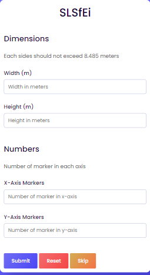
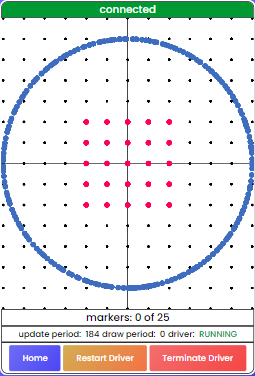

# Web Application
The purpose of this web-app is to facilitate explosive installation processes in the mining industry.
It works by receiving scan data from [SLSfEi/scan-provider-cpp](https://github.com/SLSfEi/scan-provider-cpp) and displaying it to the operator while providing markers overlay.
## Components

### Backend
The backend have the following API endpoints.
Endpoint | Request Type | Description
--- | --- | ---
/api/v1/scan | POST | For receiving scan data
/api/v1/driver | POST | For driver management

Upon receiving data at `/api/v1/scan` the backend will immediately relay data to frontend via WebSocket protocol.

- `/api/v1/scan`
    - Request
        
        POST request - CSV string with `Content-Type: text/csv`.
        
        The backend expects the string to at least have the following columns:

             x
             y
             

    - JSON Response

        Successful
        ```json
        {
            "status": "OK"
        }
        ````

        Error
        ```json
        {
            "status": "error",
            "description": "error description here"
        }
        ```

        
- `/api/v1/driver`
    - Request
        
        POST request - JSON string with `Content-Type: application/json`.
        ```json
        {
            "command": "command here"
        }
        ```
        Valid commands are:

            restart
            terminate
             

    - JSON Response

        Successful
        ```json
        {
            "status": "OK"
        }
        ````

        Error
        ```json
        {
            "status": "error",
            "description": "error description here"
        }
        ```

### Frontend
The frontend have the following pages.
URL | Name | Description
--- | --- |---
/ | Home | Home page and markers configurations
/radar | Radar | Actual radar screen with markers and driver controls

#### **Home page**



This page has form for creating marker points. Parameters submitted will be saved to browser local storage for later use in radar page.


#### **Radar page**



- This page will receive scan data from backend via WebSocket protocol.
- Draw scan data and markers according to parameters in local storage using javascript library called `PixiJS`.
- Driver controls functionality will be disabled automatically when `DRIVER_EXECUTABLE` is not found.


## Configurations
The configuration file must be named `.env` and be located in the same directory as the `settings.py` script.

**Note:** These variables can also be set as environment variables. In that case configuration file is not needed.
Variable | Type | Description
--- | --- | ---
DEBUG | boolean | Enable django debug mode
SECRET_KEY | string | Django secret key
DRIVER_EXECUTABLE | string | Path to driver or scan provider executable


**Example config file `.env`**
```
DEBUG=0
SECRET_KEY=sEcReTkEyHeRe
DRIVER_EXECUTABLE=dRiVeR/pAtH/HeRe.exe
```


# RPLidar Spoofer
Included in this repository inside `utility` directory is a python script that mimics [SLSfEi/scan-provider-cpp](https://github.com/SLSfEi/scan-provider-cpp) HTTP POST requests for ease of testing.

`rplidar_spoofer.py` accepts the following command line arguments
- `--once` or `-o` will only send the spoofing request once. If not specified, the spoofing request will be sent repeatedly and indefinitely with `0.3` second delay.
- `--sample` or `s` will use the included sample data `scan_sample.csv`. If not specified, data used will be randomly generated.
